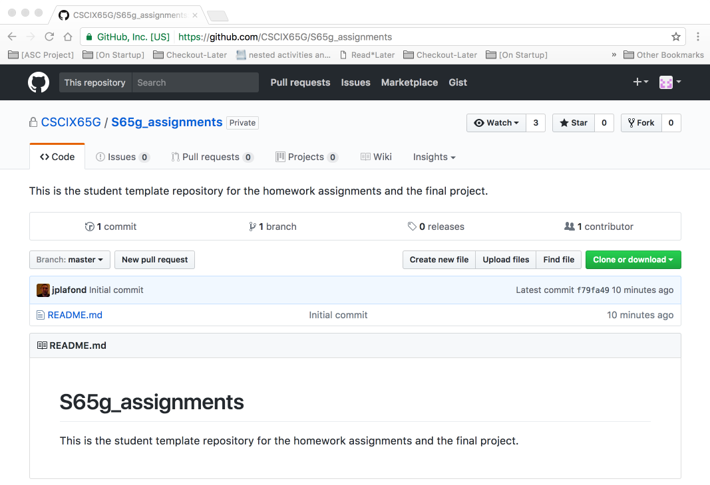
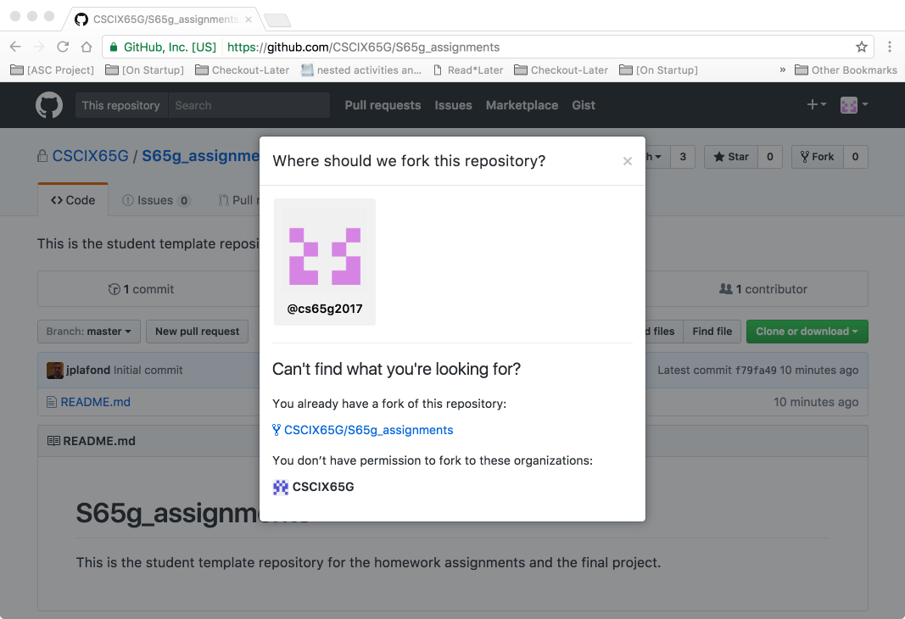
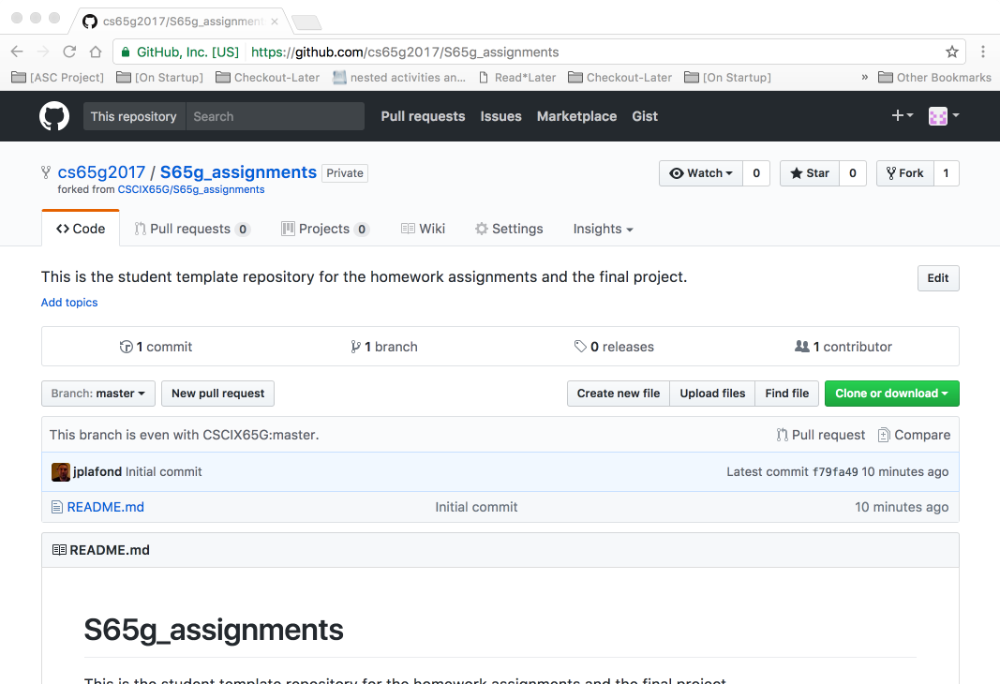
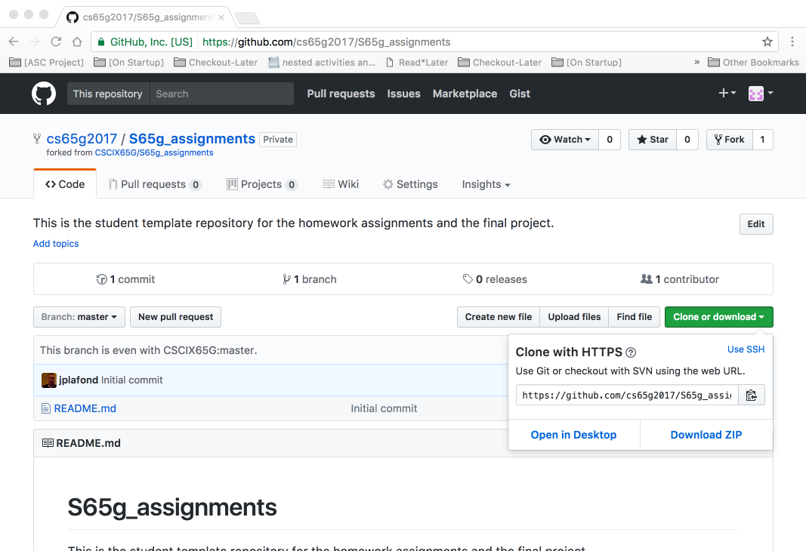

# S65GSummer18_Assignments
This is the student template repository for the homework assignments and the final project.

# How to fork this repository:

* Click on the fork button in the upper right hand corner of this screen.  You should see something like the screen below (note in the images below, the repo is for a previous class, you should use S65GSummer18_Assignments wherever you see S65g_assignments).

* As a student, you'll have access to the repository, but you'll notice that it's only the default CSCIX65G/S65GSummer18_Assignments. You'll need to click on your profile (the @<github username> at the top).

* You'll notice that at the top left, it now shows this a repository as part of your own github account.  You can click on the 'Clone or download' button now.

* You can open or cut & paste the address and use the terminal to clone it locally on your mac.

***

## Cloning the repo from the terminal window

* In the terminal window, these are the commands to clone your fork:

	* git clone https://github.com/<git username>/S65GSummer18_Assignments.git

* Afterwards, you can add a new file:

	* cd S65GSummer18_Assignments.git
	* echo "New file" > test.txt

* Add the file to the repository

	* git add test.txt
	* git commit

* And push it up

	* git push origin HEAD

## Cloning the repo from Xcode

* Inside of Xcode, Source Control, Check out...

	* Enter the repository location: https://github.com/<git username>/S65GSummer18_Assignments.git
	* You'll need to enter your github username/password so that xcode knows the authorization for this repository.
	* Then, you'll need to save this to the location of your choice.
	* Once that's been done, you'll be able to open one of the xcode projects. (Such as Assignment1

* After that's done, you'll be able to test it, as above. By editing one of the files (such as AppDelegate.swift) and adding a new line, or changing a comment.

	* The file should now have an 'M' next to it in the project navigator in Xcode, so that you'll know that it's been modified.

* Unlike with the command-line, Xcode let's you commit/push in one action: Under Xcode, Source Control, Commit...

	* If you select the Push to remote option on the lower left, you can commit and push your changes as one action.

NOTE: The screenshots for this are xRepo-00*.png